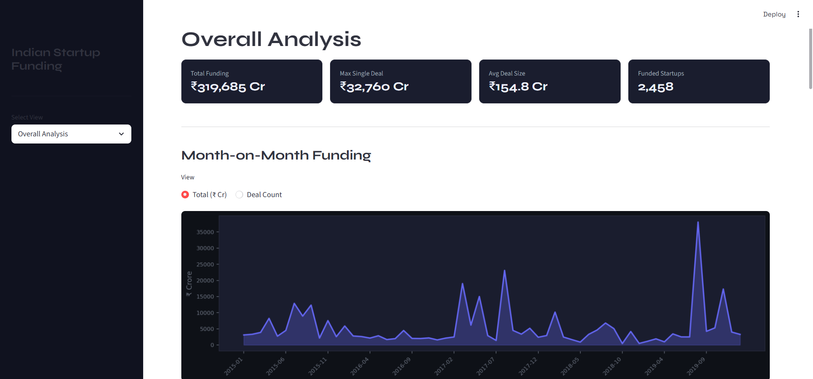
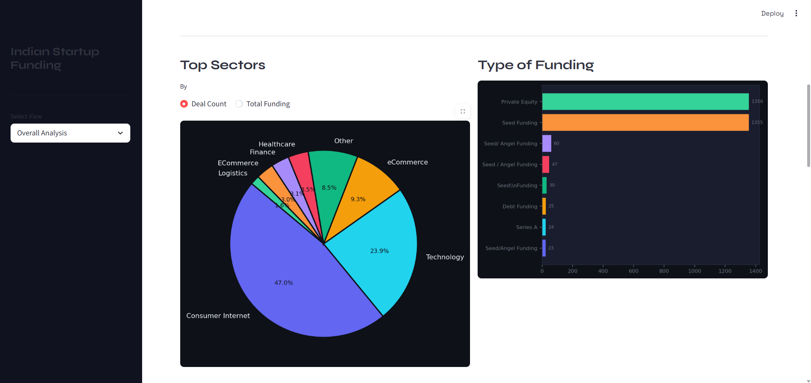
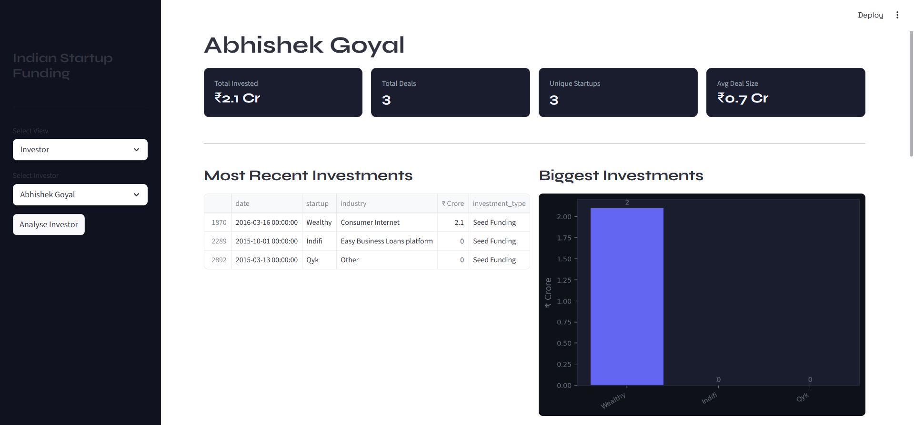
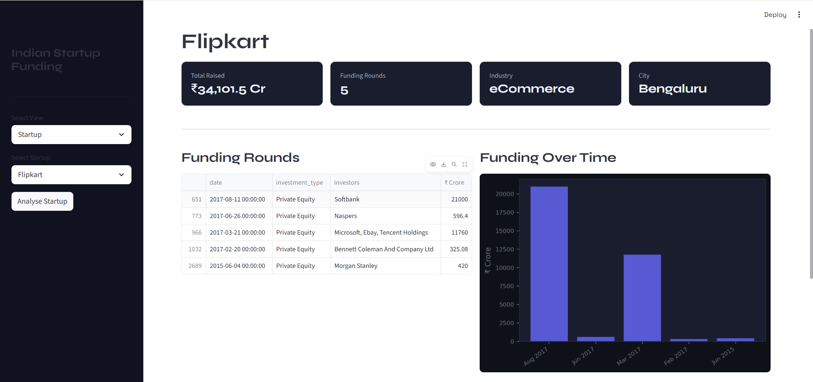

<div align="center">

```
 ███████╗████████╗ █████╗ ██████╗ ████████╗██╗   ██╗██████╗ 
 ██╔════╝╚══██╔══╝██╔══██╗██╔══██╗╚══██╔══╝██║   ██║██╔══██╗
 ███████╗   ██║   ███████║██████╔╝   ██║   ██║   ██║██████╔╝
 ╚════██║   ██║   ██╔══██║██╔══██╗   ██║   ██║   ██║██╔═══╝ 
 ███████║   ██║   ██║  ██║██║  ██║   ██║   ╚██████╔╝██║     
 ╚══════╝   ╚═╝   ╚═╝  ╚═╝╚═╝  ╚═╝   ╚═╝    ╚═════╝ ╚═╝     
```

### 💰 Indian Startup Funding Dashboard

> An interactive multi-view dashboard analysing Indian startup funding data from 2015–2020 — built with Streamlit, Pandas, and Matplotlib.

<br/>


</div>

---

## 📌 About

This is my **Indian Startup Funding Dashboard** — an interactive data analysis app built using Streamlit, exploring 3000+ funding deals across Indian startups from 2015 to 2020.

The dashboard offers three perspectives — overall market analysis, a startup-specific view, and an investor-specific view — all powered by cleaned and normalised real-world funding data.

Built to practice:
- End-to-end data cleaning on messy real-world datasets (Kaggle)
- Building multi-view interactive dashboards with Streamlit
- Creating dynamic charts with Matplotlib
- Working with Indian financial data (INR crore conversions, city normalisation)

---

## 🎬 Demo

> Full walkthrough of all three dashboard views

https://github.com/amit-0333/indian-startup-funding/blob/main/indian_startup_funding_dashboard.mp4

---

## 📸 Screenshots

### 📊 Overall Analysis


### 🏭 Top Sectors


### 🏦 Investor View


### 🏙️ City-wise Funding


### 🏢 Startup View — Flipkart


---

## 📊 Dashboard Features

### 📈 Overall Analysis
- KPI cards — Total Funding, Max Deal, Avg Deal, Total Startups
- Month-on-Month funding chart (Total ₹ / Deal Count toggle)
- Top Sectors pie chart (Count / Funding toggle)
- Type of Funding bar chart
- City-wise funding bar chart
- Top Investors bar chart
- Top Startups (year filter + top N slider)
- Funding Heatmap (Year × Month)

### 🏢 Startup POV
- KPI cards — Total Raised, Rounds, Industry, City
- All funding rounds table
- Funding over time bar chart
- Similar companies list

### 🏦 Investor POV
- KPI cards — Total Invested, Deals, Unique Startups, Avg Deal
- Most recent 5 investments table
- Biggest investments bar chart
- Sector / Stage / City preference pie charts
- Year-on-Year investment graph (₹ + Deal Count)
- Similar investors list

---

## 🗺️ Project Structure

```
indian-startup-funding/
│
├── 📂 assets/
│   ├── overall-dashboard.png
│   ├── sector.png
│   ├── inverstor.png
│   ├── city wise-investor.png
│   └── flipkart-startup.png
│
├── 📂 dataset/
│   └── startupFundingCleaned.csv
│
├── 📄 app.py                                    # Main Streamlit app
├── 📓 data-cleaning-indian-startup-funding.ipynb # Data cleaning notebook
├── 🎬 indian_startup_funding_dashboard.mp4       # Dashboard demo video
└── 📄 README.md
```

---

## 🧹 Data Cleaning

Raw dataset from Kaggle (`sudalairajkumar/indian-startup-funding`) — 3044 rows, 10 columns.

```
1. 📥 Loaded raw CSV and inspected missing values
2. 🗑️ Dropped Remarks column (86% missing)
3. 📅 Parsed Date from dd/mm/yyyy → datetime64
4. 💰 Fixed Indian-style amounts (1,00,00,000) → float
5. 💱 Converted USD → INR Crore (rate: 1 USD = ₹84)
6. 🏙️ Normalised city names — Bangalore→Bengaluru, Gurgaon→Gurugram
7. 👤 Cleaned investor names — removed parentheticals, fuzzy deduplicated
8. 🔗 Fixed URL startup names — extracted domain from URLs
9. 🔤 Fixed encoding issues — Byju\xe2\x80\x99s → BYJU'S
10. 📆 Extracted year and month columns from date
11. 💾 Saved as startupFundingCleaned.csv
```

---

## 🧪 Dataset

| Detail | Info |
|--------|------|
| **Source** | Kaggle — `sudalairajkumar/indian-startup-funding` |
| **Raw Size** | 3044 rows × 10 columns |
| **Cleaned Size** | 3044 rows × 11 columns (added year, month; dropped Remarks) |

**Key columns:**

- `date` — Funding date (datetime)
- `startup_name` — Name of the startup
- `industry` — Sector / industry vertical
- `city` — City of the startup
- `investors` — Investor name(s)
- `investment_type` — Seed / Series A / B / etc.
- `amount_in_inr_crore` — Funding amount in ₹ Crore
- `year`, `month` — Extracted from date

---

## ⚙️ How to Run

```bash
# 1. Clone the repository
git clone https://github.com/amit-0333/indian-startup-funding.git

# 2. Navigate into the folder
cd indian-startup-funding

# 3. Install dependencies
pip install streamlit pandas matplotlib

# 4. Run the app
streamlit run app.py
```

---

## 🛠️ Tech Stack

| Tool | Purpose |
|------|---------|
| 🐍 **Python** | Core language |
| 🎈 **Streamlit** | Dashboard UI and interactivity |
| 🐼 **Pandas** | Data cleaning and analysis |
| 📊 **Matplotlib** | Charts and visualisations |
| 🔍 **difflib** | Fuzzy investor name deduplication |

---

## 🎯 Learning Goals

- [x] Clean a real-world messy dataset end-to-end
- [x] Build a multi-view Streamlit dashboard
- [x] Work with Indian financial data formats (INR crore, lakh notation)
- [x] Create KPI cards, bar charts, pie charts, and heatmaps in Streamlit
- [x] Implement fuzzy string matching for data deduplication
- [x] Build startup and investor similarity features
- [x] Deploy on Streamlit Cloud
- [ ] Add date range filter across all views

---

## 👨‍💻 Author

**Amit Kumar**

[](https://github.com/amit-0333)
[](https://www.linkedin.com/in/amit-kumar-a62a3640a/)
[](https://www.kaggle.com/amitkumar038975)

---

<div align="center">

> 📝 *Built as part of my Data Science and Python learning journey.*

⭐ **Star this repo if you found it useful!**

</div>
